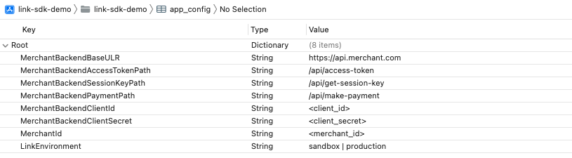

# iOS SDK Sample App

This is a public code sample demonstrating how to integrate the Link Money Pay by Bank iOS SDK into your own iOS application.

## Requirements

Please ensure you have the latest version of CocoaPods installed so that the Link Money Pay by Bank SDK can be correctly integrated. Also ensure that you have a valid client ID and secret from your merchant backend plus a valid merchant ID provided by Link Money. In order to acquire a valid Link Money merchant ID, [please reach out to us](https://www.link.money/contact).

## Installation

In order to install CocoaPods please follow this [guide](https://cocoapods.org/)

After CocoaPods has been installed run `pod install` to add the Link Money Pay by Bank SDK to your project. Replace the corresponding credentials and configurations in the `app_config.plist` file with your own values. The project should now be ready to be use.

Please ensure that the correct credentials for the merchant backend, the URL and path to the merchant backend services and the Link merchant ID correspond to the appropriate environment. The available Link Money environments are `sandbox` and `production`.

For further information regading what services are needed from the merchant backend please refer to [our documentation](https://developer.link.money/)

## Linking and Payment

The linking and payment process can be broken into four steps.

1.  Merchant backend generates an access token.
2.  Merchant backend generates a session key.
3.  User’s account is linked using the Link Money Pay by Bank SDK with a customer ID being generated.
4.  Merchant backend makes a payment request using the appropriate tokens plus the customer ID.

For further information please refer to [our documentation](https://developer.link.money/).
